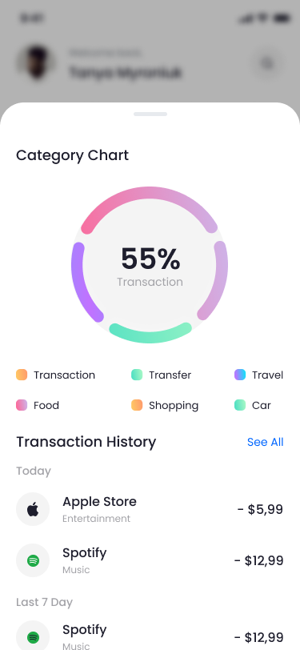
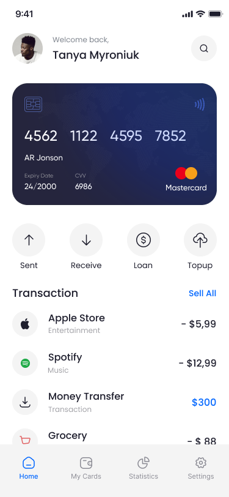
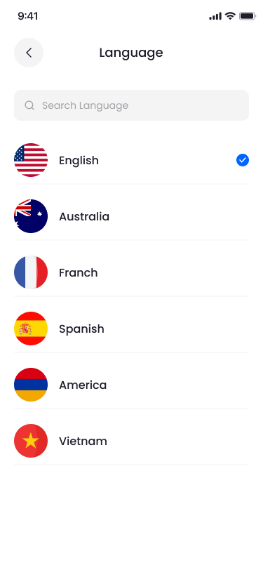
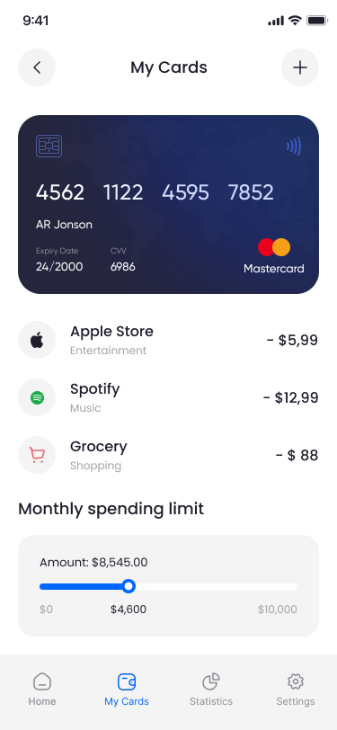
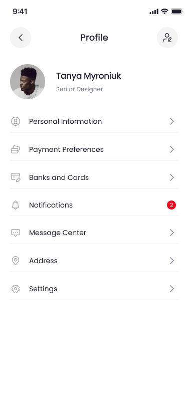
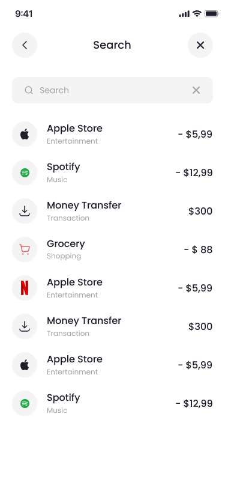
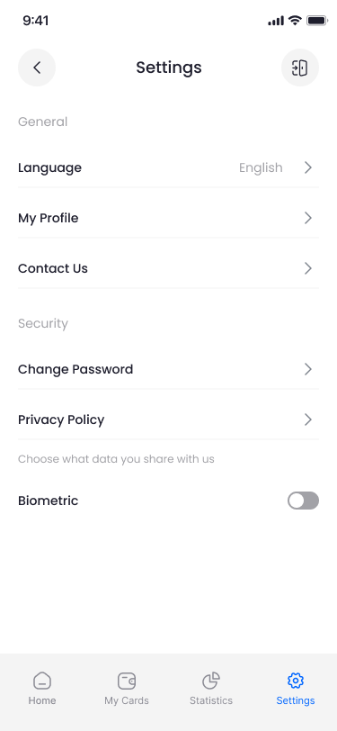
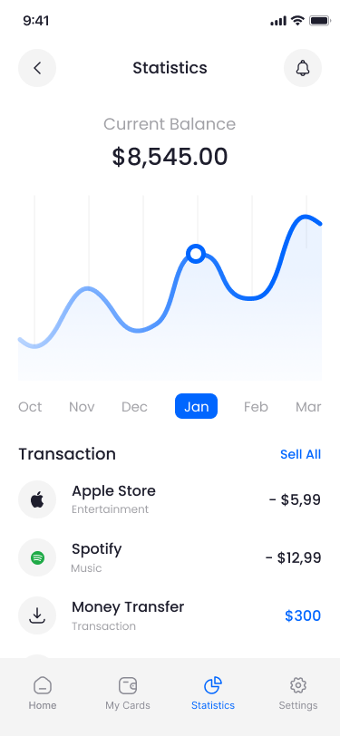

# UI

Dưới đây là danh sách các tệp ảnh (định dạng .png) được hiển thị:

- **Add New Card**  
  

- **Add New Card-1**  
  

- **Edit Profile**  
  

- **History**  
  

- **Home**  
  

- **Language**  
  

- **My-Cards**  
  

- **Profile**  
  

- **Search**  
  

- **Send Money**  
  

- **Send Money-1**  
  

- **Settings**  
  

- **Statistics**  
  

- **Transaction History**  
  

